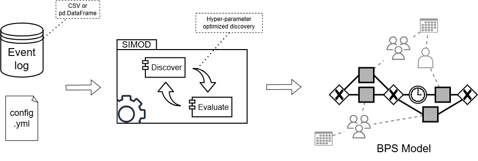

.. SIMOD documentation master file, created by
   sphinx-quickstart on Mon Jan 27 16:09:16 2025.
   You can adapt this file completely to your liking, but it should at least
   contain the root `toctree` directive.

SIMOD: Automated discovery of business process simulation models
================================================================

SIMOD combines process mining and machine learning techniques to automate the discovery and tuning of Business Process
Simulation models from event logs extracted from enterprise information systems (ERPs, CRM, case management systems,
etc.). SIMOD takes as input an event log in CSV format, a configuration file, and (optionally) a BPMN process model,
and discovers a business process simulation model that can be simulated using the Prosimos simulator, which is embedded
in SIMOD.

.. _fig_simod:

    SIMOD main workflow.

In its standard workflow, SIMOD receives an event log and a configuration file, and
runs an iterative process to discover the BPS model that bests reflect the behavior captured in the input event log.
This iterative process is designed as a pipeline-based architecture composed of multiple stages that run a
TPE-optimization process to obtain the parameters that lead to the most accurate model.

Alternatively, SIMOD can additionally receive as input a BPMN model of the process. In this case, SIMOD skips the
corresponding discovery phase, and builds the BPS model over the input BPMN model.

.. note::
   This project is under active development.

.. toctree::
   :maxdepth: 2
   :caption: Contents:

   installation
   usage
   api
   citation
